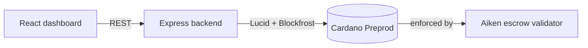

# StellarVault

> Trustless milestone escrow for freelance & remote work, built on Cardano.

[](https://github.com/okokok04/stellarvault/actions/workflows/ci.yml)
[](https://github.com/okokok04/stellarvault/actions/workflows/deploy-frontend.yml)
[](LICENSE)
[](docs/SETUP.md)

Cross-border freelance work has a trust problem in both directions: buyers
don't want to pay upfront for undelivered work, and sellers don't want to
deliver work they might never get paid for. **StellarVault** locks each
milestone's payment in a Cardano smart contract that releases funds only
under one of three signature-checked conditions — no platform, and no
StellarVault backend, can move the money any other way.

## Live Preprod deployment

| | |
| --- | --- |
| **Network** | Cardano Preprod |
| **Escrow validator address** | `<run scripts/deploy-preprod.ts --verify and paste the script address here>` |
| **Bootstrap transaction** | `<paste the tx hash / cardanoscan link here>` |
| **Dashboard (live demo)** | `<paste the GitHub Pages / hosting URL here>` |
| **Backend API** | `<paste the public backend URL here>` |

See [`docs/deployment.json`](docs/deployment.json) (generated by
`scripts/deploy-preprod.ts`) for the machine-readable record, and
[`docs/SETUP.md`](docs/SETUP.md) for how to reproduce this deployment.

## Product

- **X profile**: `<link to the StellarVault X/Twitter profile>` — see
  [`demo/X_PROFILE.md`](demo/X_PROFILE.md) for bio/pinned post copy.
- **Demo video**: `<link once recorded>` — script in
  [`demo/DEMO_SCRIPT.md`](demo/DEMO_SCRIPT.md).

## How it works



1. **Lock** — buyer, seller, and arbiter addresses plus a milestone
   amount and deadline are locked at the validator's script address.
2. **Release** — buyer signs off on delivery; the seller is paid.
3. **Refund** — if the deadline passes with no release, the buyer signs
   to reclaim the funds.
4. **Resolve** — if buyer and seller can't agree, the named arbiter signs
   to direct funds to either side, so an escrow is never stuck forever.

Full design rationale: [`docs/ARCHITECTURE.md`](docs/ARCHITECTURE.md).

## Repository layout

```
contracts/   Aiken validator: the on-chain, privacy-critical core
backend/     Express API + Lucid off-chain transaction builders
frontend/    Vite + React dashboard (wallet connect, escrow lifecycle UI)
scripts/     Preprod deployment script
docs/        Architecture, setup, and usage documentation
demo/        Demo video script and X profile launch copy
```

## Tech stack

- **Smart contract**: [Aiken](https://aiken-lang.org) → Plutus V3
- **Off-chain**: Node.js, TypeScript, Express, [Lucid](https://github.com/spacebudz/lucid), [Blockfrost](https://blockfrost.io)
- **Frontend**: Vite, React, TypeScript, CIP-30 wallet connect
- **CI/CD**: GitHub Actions (contract check/build, backend + frontend
  lint/test/build, frontend deploy to GitHub Pages)

## Quick start

```sh
git clone https://github.com/okokok04/stellarvault.git
cd stellarvault

cd contracts && aiken check && aiken build && cd ..
cd backend && cp .env.example .env && npm install && npm run dev &
cd frontend && cp .env.example .env && npm install && npm run dev
```

Full walkthrough (funding a Preprod wallet, deploying the contract,
configuring CI/CD): [`docs/SETUP.md`](docs/SETUP.md).
Using the dashboard and the raw REST API: [`docs/USAGE.md`](docs/USAGE.md).

## Testing

```sh
cd contracts && aiken check      # validator unit tests
cd backend    && npm test        # API + store tests (on-chain calls mocked)
cd frontend   && npm test        # component tests
```

All three run in CI on every push/PR — see
[`.github/workflows/ci.yml`](.github/workflows/ci.yml).

## Roadmap

- Move transaction *building* to the frontend so the connected wallet
  signs directly, removing the backend's custody of a signing key.
- Replace the JSON-file store with Postgres once escrow volume justifies it.
- Support multi-milestone contracts (a single escrow covering several
  sequential payments) instead of one validator instance per milestone.

## License

[MIT](LICENSE)
